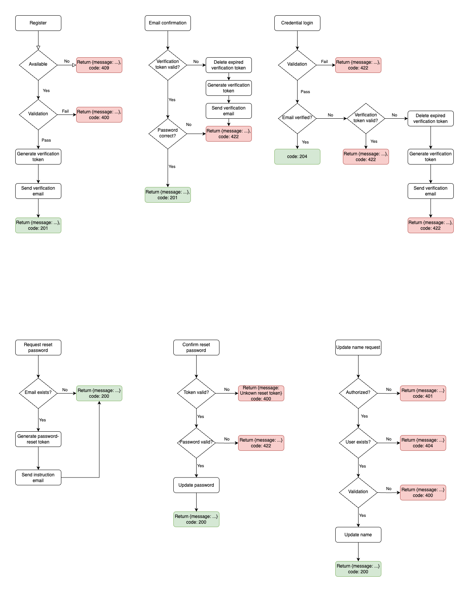

# INTRODUCTION

This is a learning project following the tutorial of Antonio: [Next Auth 5 - Advanced Guide]('https://www.codewithantonio.com/projects/auth-masterclass')

It uses [Next Auth 5]('https://authjs.dev/') to handle the authorization of web application in [Next.js V14]('https://nextjs.org/') framework.

The tutorial was very inspiring, I get to know many libraries from it. But after the tutorial, I found myself not happy with the folder sturcture and code styles, so I decide to refactor the whole application following my own logic and coding style. Of course the tutorial was not aimed at such points, it just focus on how to use the Next Auth 5, which was clearly pointed out in the turorial.

So this is a good opportunity to practice coding. By refactor this project, I could strengthen my understanding of the techs it uses, and improve my ability of wrting documentation.

## WHAT CAN BE IMPROVED OF THE ORIGINAL CODE BASE

1. File Structure
2. Data flow logic
3. Naming convention
4. Reusable components/modules
5. Responsive web design
6. Testing

# FEATURES

## Register

- Use email, name and password to register new user
- Send confirmation email to the user after the registration, user needs to input the password again.
- If email already exists which was used by OAuth methods before, add password to the user.

## Sign-in

- Credendials: email and password - ~~2FA email for better security~~
- OAuth: Google and Github

## Update

- Can ONLY update name
- Password can only be reset (if credentials exists) in the Sign-in page

## Sign-out

- Simply sign-out function, nothing special

## Others

- Validations
  - Client-side: use react-hook-form to display errors
  - Server-side: use toast to display errors
- Expirations
  - Email confirmation: 5 minutes
  - Reset password: 5 minutes
  - ~~2FA verification: 1 minute~~

# DATA FLOW CHART



# TECH STACKS

- Next.js 14.2.4
- Next Auth 5.0.0-beta.18
- Prisma 5.16.1
- React-hook-form 7.52.1
- Zod 3.23.8
- Resend 3.4.0
- Sonner - 1.5.0

# STRUCTURE

## Original

**Only shows non-auto created files**

```
.
  ├── actions
      ├── admin.ts
      ├── login.ts
      ├── logout.ts
      ├── new-password.ts
      ├── new-verification.ts
      ├── register.ts
      ├── reset.ts
      └── settings.ts
  ├── app
      ├── (protected)
          ├── _components
          ├── admin
          ├── client
          ├── server
          ├── settings
          └── layout.tsx
      ├── api
          ├── admin
          └── auth
      ├── auth
          ├── error
          ├── login
          ├── new-password
          ├── new-verification
          ├── register
          ├── reset
          └── layout.tsx
      ├── layout.tsx
      └── page.tsx
  ├── components
      ├── auth
          ├── back-button.tsx
          ├── card-wrapper.tsx
          ├── header.tsx
          ├── login-button.tsx
          ├── login-form.tsx
          ├── logout-button.tsx
          ├── new-password-form.tsx
          ├── new-verification-form.tsx
          ├── register-form.tsx
          ├── reset-form.tsx
          ├── role-gate.tsx
          ├── social.tsx
          └── user-button.tsx
      ├── ui
      ├── form-error.tsx
      ├── form-success.tsx
      └── user-info.tsx
  ├── data
      ├── account.ts
      ├── password-reset-token.ts
      ├── two-factor-confirmation
      ├── two-factor-token.ts
      ├── user.ts
      └── verification-token.ts
  ├── hooks
      ├── user-current-role.ts
      └── use-current-user.ts
  ├── lib
      ├── auth.ts
      ├── db.ts
      ├── mail.ts
      ├── tokens.ts
      └── utils.ts
  ├── prisma
  ├── public
  ├── schemas
      └── index.ts
  ├── auth.config.ts
  ├── auth.ts
  ├── middleware.ts
  ├── next-auth.d.ts
  └── routes.ts
```

## REFACTORED

// TODO

# REFACTOR PLAN

- [x] Features design
- [x] ERD
- [x] Data flow chart
- [] Document Restful API endpoints
- [] Register module
- [] Email confirmation module
- [] SignIn module
- [] 2FA verification module
- [] Settings
- [] Testing (Optional but better have)

# ROUTES AND ENDPOINTS

## Routes

/sign-in

/sign-in/password-reset

/sign-in/password-reset/{token}

/sign-up

/sign-up/confirm/{token}

## Endpoints

/api/v1/[...]

# OTHERS

**_This section is for temporary use, I may modify/delete it during the refactoring_**

When verifiying the email after the registration, user should input the password again. This could better handle if user typo email address.

Find a way so that user have the same 'user' when login using credential, Google or GitHub. Which I found Prisma.io is function in this way. And Prisma.io is not allowed user to modify the password, not allowed to change email. If user forgot password, they can only use 'forgot password' function.
